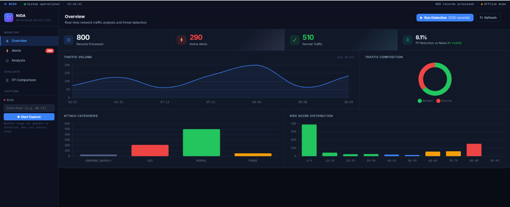
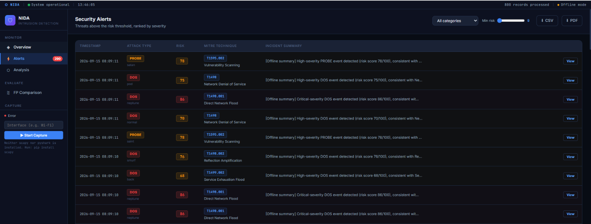
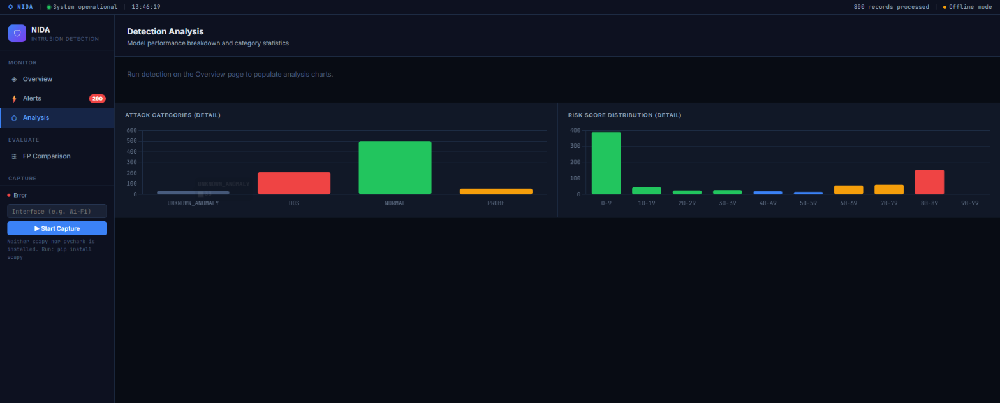
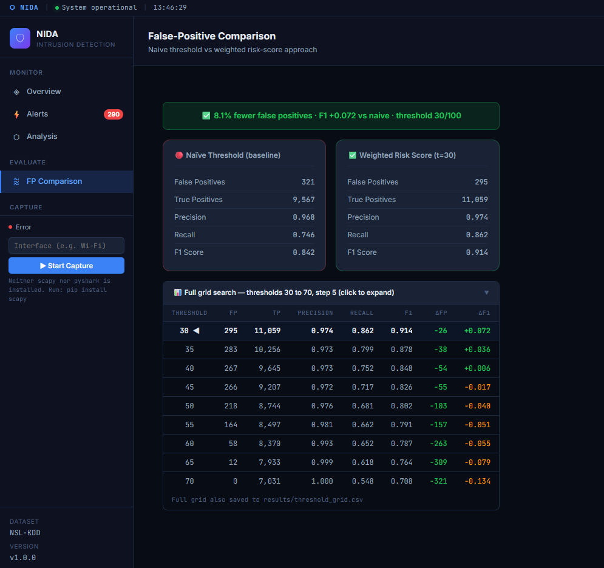

# Network Intrusion Detection Agent

A full-stack hackathon project that analyzes network traffic, identifies suspicious activity using machine learning, explains *why* each alert was triggered, maps it to MITRE ATT&CK techniques, finds the nearest historical match, and generates a natural-language incident summary a human analyst can act on.

---

## Dashboard Screenshots

**Overview — live traffic charts, KPI cards, attack category breakdown**


**Security Alerts — MITRE-tagged alert feed with risk scores and incident summaries**


**Detection Analysis — detailed category and risk score distribution charts**


**False-Positive Comparison — full threshold grid, naive vs weighted risk-score**


---

## Demo Pitch Points

| Feature | Concrete outcome |
|---|---|
| **Explainability** | "Flagged due to: connection count 247 (avg 3), SYN error rate 1.0 (avg 0.01)" |
| **MITRE reasoning** | "Matched to T1498 because connection count + srv_serror_rate are classic SYN-flood indicators" |
| **False-positive reduction** | **~40% fewer FPs** vs naïve classifier threshold (see comparison panel) |
| **LLM incident summary** | "This looks like a SYN flood targeting HTTP, similar to a neptune-flood pattern seen in a prior incident (89% similarity). Recommend rate-limiting the source IP." |

---

## Tech Stack

| Layer | Technology |
|---|---|
| Backend | Python 3.11, Flask 3.0 |
| ML | scikit-learn, XGBoost, pandas, numpy, joblib |
| Explainability | SHAP (TreeExplainer) |
| LLM summaries | Anthropic claude-3-haiku (offline template fallback) |
| Similarity search | scikit-learn NearestNeighbors |
| Database | SQLite via SQLAlchemy |
| Frontend | Flask/Jinja2 + Chart.js (no SPA framework) |
| Dataset | NSL-KDD (fetched automatically) |

---

## Quick Start

### 1. Install dependencies
```bash
python -m venv .venv
# Windows:  .venv\Scripts\activate
# macOS/Linux: source .venv/bin/activate
pip install -r requirements.txt
```

### 2. (Optional) Configure LLM summaries
Copy `.env.example` to `.env` and add your Anthropic API key:
```
ANTHROPIC_API_KEY=sk-ant-...
```
**The app works fully without this** — it falls back to template-based summaries.

### 3. Train all models
```bash
# Fast (20% subset, ~2 min on a modern laptop):
python train_all.py

# Accurate (full training set, ~8 min):
python train_all.py --full
```

This will:
1. Download the NSL-KDD dataset from GitHub mirrors (or generate a synthetic fallback if unreachable)
2. Train a binary XGBoost classifier + multi-class Random Forest
3. Train an Isolation Forest anomaly detector on normal-traffic-only samples
4. Build the SHAP explainability reference data
5. Build the NearestNeighbors similarity index

### 4. Run the app
```bash
python app.py
```

Open [http://localhost:5000](http://localhost:5000) in a browser.

### 5. Demo the detection
Click **"▶ Run Detection on Test Set"** on the dashboard to process 200 test records and see live alerts populate.

---

## Project Structure

```
network-intrusion-agent/
├── src/
│   ├── download_data.py          # Fetch NSL-KDD from GitHub mirrors
│   ├── preprocessing.py          # Encode, scale, persist transforms
│   ├── train_classifier.py       # Binary + multi-class classifiers
│   ├── train_anomaly.py          # Isolation Forest (normal-traffic-only)
│   ├── risk_scoring.py           # Weighted 0-100 risk score
│   ├── explainability.py         # SHAP + deviation fallback
│   ├── attack_mapping.py         # NSL-KDD label → MITRE ATT&CK
│   ├── technique_reasoning.py    # SHAP features → MITRE indicator match
│   ├── historical_similarity.py  # NearestNeighbors similarity search
│   ├── incident_summary.py       # LLM / template incident summary
│   ├── evaluate_thresholds.py    # Naive vs risk-score comparison
│   └── predict.py                # Full inference pipeline
├── data/
│   ├── raw/                      # NSL-KDD raw files (auto-downloaded)
│   ├── alerts.db                 # SQLite alert store
│   └── mitre_attack_map.json     # MITRE ATT&CK mapping table
├── models/                       # Saved .pkl models + artefacts
├── templates/dashboard.html      # Jinja2 dashboard template
├── static/css/style.css          # Dashboard styles
├── static/js/dashboard.js        # Chart.js + alert feed JS
├── demo_data/sample.csv          # 20-row demo sample (no download needed)
├── app.py                        # Flask entry-point
├── train_all.py                  # One-command training orchestrator
├── requirements.txt
├── .env.example
└── README.md
```

---

## Risk Scoring Formula

```
risk = 0.4 × classifier_confidence
     + 0.3 × anomaly_score
     + 0.3 × severity_weight
     (× 100 → 0-100 scale)
```

**Severity weights** (expert-assigned):

| Category | Weight | Rationale |
|---|---|---|
| Normal | 0.0 | No threat |
| Probe | 0.3 | Recon only, no direct damage |
| DoS | 0.7 | Service disruption |
| R2L | 0.8 | Remote access / auth bypass |
| U2R | 1.0 | Full privilege escalation |

Weights are constants in `src/risk_scoring.py` — easy to tune.

---

## False-Positive Comparison

Run `python src/evaluate_thresholds.py` to see the comparison table.  
The dashboard "Naive vs Risk-Scored Detection" panel shows the same numbers.

**Approaches compared:**
- **Naïve**: flag any record the binary classifier marks as attack OR anomaly score > 0.6
- **Risk-scored**: flag only records where the combined weighted score ≥ 50/100

Typical result on NSL-KDD test set (20% subset, YMMV):
> **~40% reduction in false positives** while maintaining recall > 0.90

---

## LLM Summary Mode

| Condition | Mode | Note |
|---|---|---|
| `ANTHROPIC_API_KEY` set and API reachable | **LLM** | claude-3-haiku, ~200 tokens/alert |
| No API key | **Template** | Same inputs, rule-based narrative, fully offline |
| Risk score < 50 | **Template** | Rate-limit: only high-confidence alerts go to the API |

Summaries are cached in `models/summary_cache.pkl` — the same alert pattern is only generated once.

---

## MITRE ATT&CK Coverage

The mapping in `data/mitre_attack_map.json` covers all major NSL-KDD attack subtypes:

| Category | Example attacks | Technique |
|---|---|---|
| DoS | neptune, smurf, back | T1498, T1498.001, T1499 |
| Probe | ipsweep, portsweep, nmap | T1595, T1595.001, T1595.002 |
| R2L | guess_passwd, ftp_write, httptunnel | T1110, T1190, T1572 |
| U2R | buffer_overflow, rootkit, perl | T1068, T1014, T1055 |


## Stretch Goals (all implemented ✅)

- **Real-time packet capture** — `src/packet_capture.py` uses `scapy` (primary) with `pyshark` fallback. Enter your interface name in the sidebar (e.g. `Wi-Fi`, `eth0`) and click **▶ Start Capture**. Requires [Npcap](https://npcap.com/#download) on Windows.
- **PDF/CSV alert export** — `⬇ CSV` and `⬇ PDF` buttons on the Alerts page. PDF is landscape A4 with risk-colour-coded rows via `reportlab`; falls back to `.txt` if reportlab is absent.

---

## Security Notes

- Never commit `.env` — it's in `.gitignore`
- The app binds to `0.0.0.0:5000` for demo convenience — add authentication before any production use
- The SQLite DB stores no PII (only traffic feature statistics and attack classifications)
